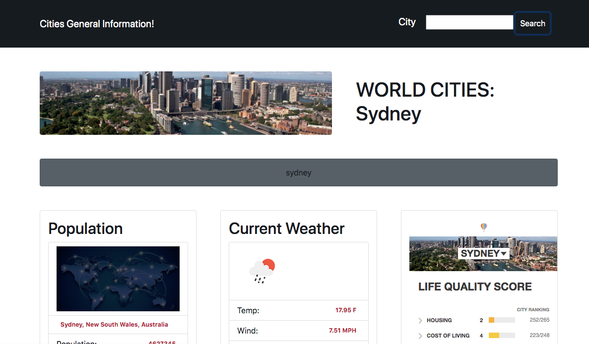

# 🌍 World cities stats

  ## Description

  This is an informative site for people interested in knowing more about different cities around the world, its population, current weather, the cost of living, etc.

[Cities Stats ](https://nancymile.github.io/Cities-stats/)

  ## Table of Contents

  - [Usage](#usage)
  - [Languages](#languages)
  - [Apis](#apis)
  - [Tutorials](#tutorials)
  - [License](#license)
  - [Features](#features)

  ## Usage

  Usage Instructions:
  Once at
  The user should just type the name of the city and hit search!.

  ## Mock-Up

The following Image shows an example of the application when searching for Sydney.

####   Languages

- HTML
- CSS
- JavaScript

####   Apis

- teleport
- openweathermap

####   Tutorials
- stack overflow
- w3Schools
- labstack
- bootstrap

  ## License

  This application is licensed under Creative Commons

  CC0

  ## Features
  - Populaion 👪
  - Climate 🌦️
  - Cost of Living 📈
  - Images 🌉
  - Life quality Score ⭐️

  

  - - -
© 2022 Nancy S. All Rights Reserved.

